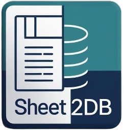
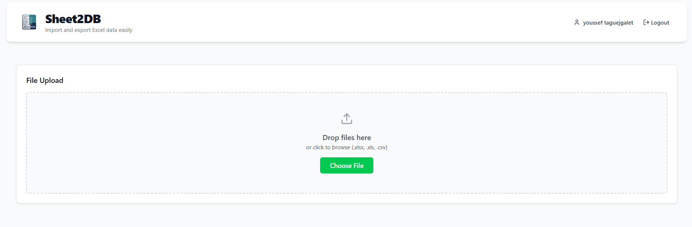
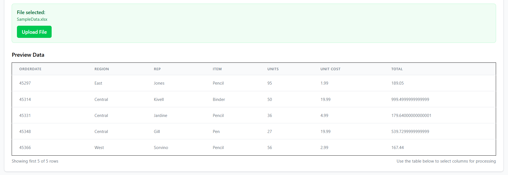
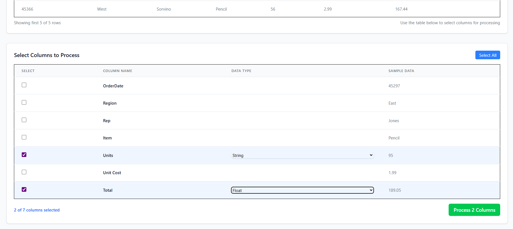
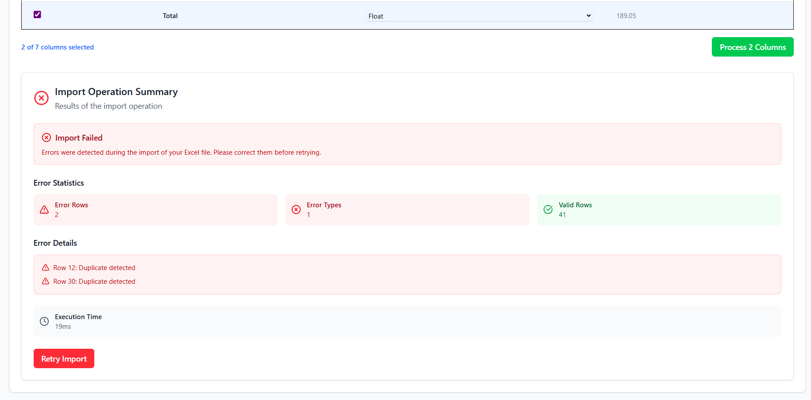
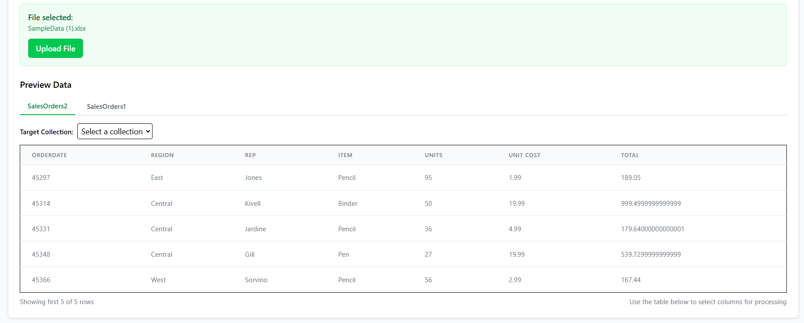

# Sheet2DB 📊➡️🗄️

A modern web application for seamlessly importing Excel and CSV files into MongoDB databases with an intuitive interface and powerful validation features.



## 🌟 Overview

Sheet2DB simplifies the process of importing structured data from spreadsheet files into MongoDB databases. Built with modern web technologies, it provides a user-friendly interface for data validation, column selection, and automated database insertion.

*This project was developed during an internship at **Norsys**, focusing on modern web development practices and database integration solutions.*

## 🏗️ Project Structure

This repository contains multiple versions of the application, each with enhanced features:

### Repository Branches

- **`main`** - Latest stable version (v3) with authentication
- **`v1`** - Initial version with single-sheet support
- **`v2`** - Enhanced version with multi-sheet Excel support  
- **`dev`** - Development branch (v3 features)

### Version Features

| Version | Features |
|---------|----------|
| **v1** | ✅ Single Excel/CSV sheet import<br>✅ Data preview and validation<br>✅ Column selection<br>✅ MongoDB insertion |
| **v2** | ✅ All v1 features<br>✅ Multi-sheet Excel support<br>✅ Tab navigation interface<br>✅ Per-sheet collection selection |
| **v3** | ✅ All v2 features<br>✅ User authentication system<br>✅ Secure access control |

## 🚀 Getting Started

### Prerequisites

- Node.js (v16 or higher)
- MongoDB database
- Git

### Installation

1. **Clone the repository**
   ```bash
   git clone https://github.com/yssf132/Sheet2DB-Internship.git
   cd Sheet2DB-Internship
   ```

2. **Choose your version**
   ```bash
   # For latest version with authentication (v3)
   git checkout main
   
   # For single-sheet support (v1)
   git checkout v1
   
   # For multi-sheet support (v2)
   git checkout v2
   
   # For development version
   git checkout dev
   ```

3. **Backend Setup**
   ```bash
   cd backend
   npm install
   cp .env.example .env
   # Configure your MongoDB URI in .env
   npm run dev
   ```

4. **Frontend Setup**
   ```bash
   cd frontend
   npm install
   npm run dev
   ```

### Environment Configuration

Create a `.env` file in the backend directory by copying the example:

```bash
cp .env.example .env
```

Then configure your MongoDB URI and other settings as needed for your version.

## 🎯 Key Features

### 📂 File Upload Support
- Excel files (.xlsx, .xls)
- CSV files (.csv)
- File size validation (10MB max)
- Format verification

### 👀 Data Preview
- Interactive data preview
- Column type detection
- Real-time validation feedback

### ✅ Smart Validation
- Format validation
- Empty field detection
- Duplicate detection
- Data type consistency checks

### 🎛️ Flexible Import Options
- Column selection interface
- Custom collection naming
- Multi-sheet processing (v2+)
- Batch operations

### 🔐 Security
- JWT-based authentication
- Secure API endpoints
- User session management

## 📸 Screenshots

### Version 1 & 2 Interface

#### File Upload Interface


#### Data Preview Interface


#### Column Selection Interface


#### Successful Import Interface


#### Error Message Interface


### Version 2 - Multi-Sheet Support

#### Multi-Tab Interface


## 🛠️ Technology Stack

### Frontend
- **React 18** - Modern UI library
- **TypeScript** - Type-safe development
- **Vite** - Fast build tool
- **Tailwind CSS** - Utility-first styling
- **Axios** - HTTP client

### Backend
- **Node.js** - Runtime environment
- **Express.js** - Web framework
- **TypeScript** - Type safety
- **MongoDB** - NoSQL database
- **Mongoose** - ODM library
- **Multer** - File upload handling
- **JWT** - Authentication

### Development Tools
- **Figma** - UI/UX Design
- **Jira** - Project management
- **GitHub** - Version control
- **Visual Studio Code** - IDE

## 📋 Usage Workflow

1. **Upload File** - Select and upload your Excel/CSV file
2. **Preview Data** - Review the detected columns and data structure
3. **Select Columns** - Choose which columns to import
4. **Validate** - System performs comprehensive data validation
5. **Configure** - Set collection name and import options
6. **Import** - Data is inserted into MongoDB with status feedback

## 🏛️ Architecture

```
┌─────────────────┐    HTTP/REST    ┌─────────────────┐
│   React Client  │ ◄──────────────► │  Express Server │
│   (Frontend)    │                 │   (Backend)     │
└─────────────────┘                 └─────────────────┘
                                            │
                                            ▼
                                    ┌─────────────────┐
                                    │    MongoDB      │
                                    │   (Database)    │
                                    └─────────────────┘
```

## 📊 Project Management

The project was developed using Agile methodologies with:
- **Jira** for task tracking and sprint planning
- **GitHub** for version control and collaboration
- **Iterative development** with continuous integration

## 🤝 Contributing

1. Fork the repository
2. Create a feature branch (`git checkout -b feature/new-feature`)
3. Commit your changes (`git commit -m 'Add new feature'`)
4. Push to the branch (`git push origin feature/new-feature`)
5. Open a Pull Request

## 🏢 Acknowledgments

This project was developed during an internship program at **[Norsys](https://www.norsys.fr)**, a leading IT consulting and software development company. Special thanks to the Norsys team for their guidance and support throughout the development process.

## 📄 License

This project is licensed under the ISC License.

---

**Sheet2DB** - Transforming spreadsheets into structured databases with ease! 🚀
